# VK Реклама — 10 объявлений

Файл собирается скриптом `node scripts/vk-ads.mjs` из `ads.mjs` — правьте тексты там.

**Формат:** универсальное объявление, цель «Сайт». Картинки: `img/<ключ>-1x1.jpg` (1080×1080) и `img/<ключ>-4x5.jpg` (1080×1350) — грузите обе, кабинет сам подберёт под площадку.
**Ссылка:** у каждого объявления своя метка `from=vk_<ключ>` — переходы и регистрации видны в админке → «Источники».
**Лимиты полей:** заголовок 40, короткое описание 90, длинное 220, текст рядом с кнопкой 30 символов (скрипт проверяет).

Как тестировать: запустите все 10 в одной группе с одинаковым бюджетом на 2–3 дня, отключите те, где цена регистрации (метка в «Источниках») выше средней в 1,5 раза, и долейте бюджет в 2–3 лучших.

Модерация: в текстах нет «лучший / №1» (по закону о рекламе нужно подтверждение) и упоминаний Минздрава как «одобрения» — не добавляйте их. Объявления про обучение, а не про медицинские услуги, поэтому лицензия не нужна; если модератор спросит — это образовательный тренажёр для студентов.

## Промпты для ChatGPT — как пользоваться

1. Вставьте промпт как есть. Если формат не тот — допишите «соотношение сторон 1:1» или «4:5».
2. В большинстве промптов текста на картинке нет: так модель не ошибётся в русских буквах, а заголовок и подпись под картинкой даёт сам ВК. Хотите надпись на картинке — допишите: «Сверху крупная надпись на русском: "<заголовок>" шрифтом с засечками, проверь орфографию».
3. Текст на картинке в VK Рекламе — не больше ~20% площади, иначе охват может падать.

---

## a01 · Аккредитация

| | |
|---|---|
| 1:1 | 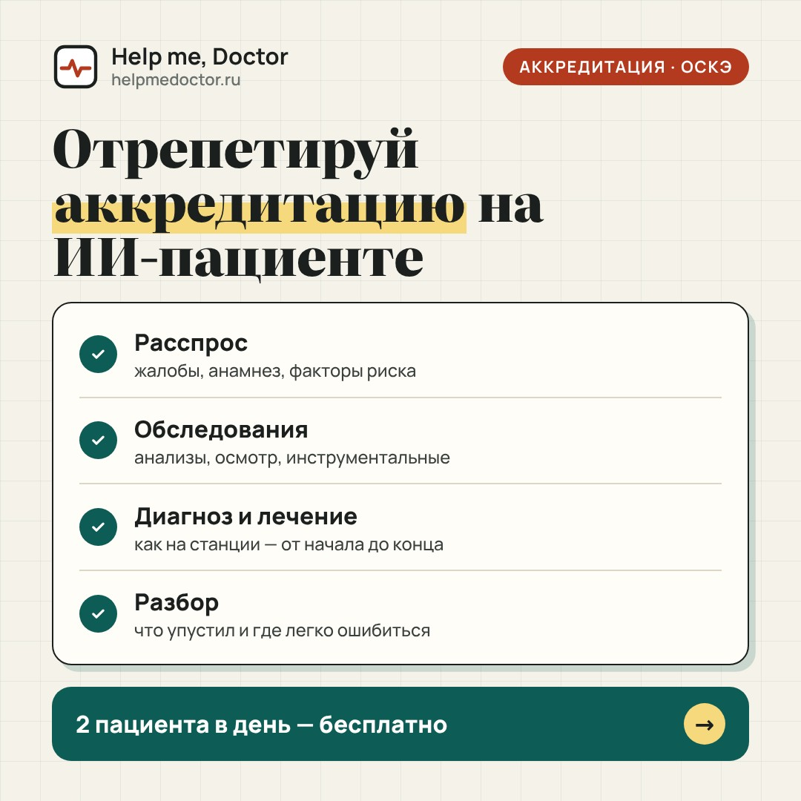 |
| 4:5 | 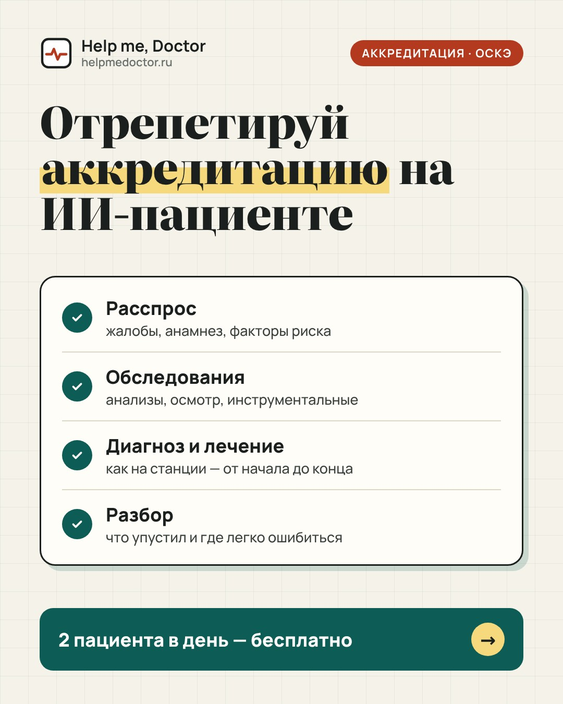 |

| Поле | Текст | Символов |
|---|---|---|
| Заголовок | Репетиция аккредитации на ИИ-пациенте | 37/40 |
| Короткое описание | Расспрос, анализы, диагноз и разбор ошибок — тренажёр приёма для студентов-медиков | 82/90 |
| Длинное описание | Пациент жалуется своими словами, ты собираешь анамнез, назначаешь обследования и ставишь диагноз. После приёма — оценка и вывод эксперта: что упустил и на чём легко ошибиться. 2 пациента в день бесплатно. | 204/220 |
| Текст рядом с кнопкой | 2 пациента в день бесплатно | 27/30 |
| Кнопка | Попробовать | |
| Ссылка | https://helpmedoctor.ru/app?from=vk_a01 | |

**Промпт для ChatGPT:**

> Фотореалистичная сцена, вертикальный кадр 4:5. Студентка-медик лет 21 в белом халате и со стетоскопом на шее сидит за столом в учебной аудитории медицинского вуза и сосредоточенно смотрит в смартфон; на экране смартфона виден мессенджер-подобный чат с пациентом (бирюзовые и белые пузыри сообщений, текст неразборчив). Рядом на столе — раскрытый конспект, маркер, бейдж «Аккредитация». Тёплый дневной свет из окна, мягкий фон с размытием, спокойная уверенная атмосфера. Цвета: тёплая бумага #f5f2e9, глубокий бирюзовый #0d5c55, акцент кирпично-красный #b3391f. Без логотипов и брендов. Сверху свободное пространство под заголовок (примерно треть кадра однотонная). Текст на картинке не добавляй.

---

## a02 · Пациент недоговаривает

| | |
|---|---|
| 1:1 | 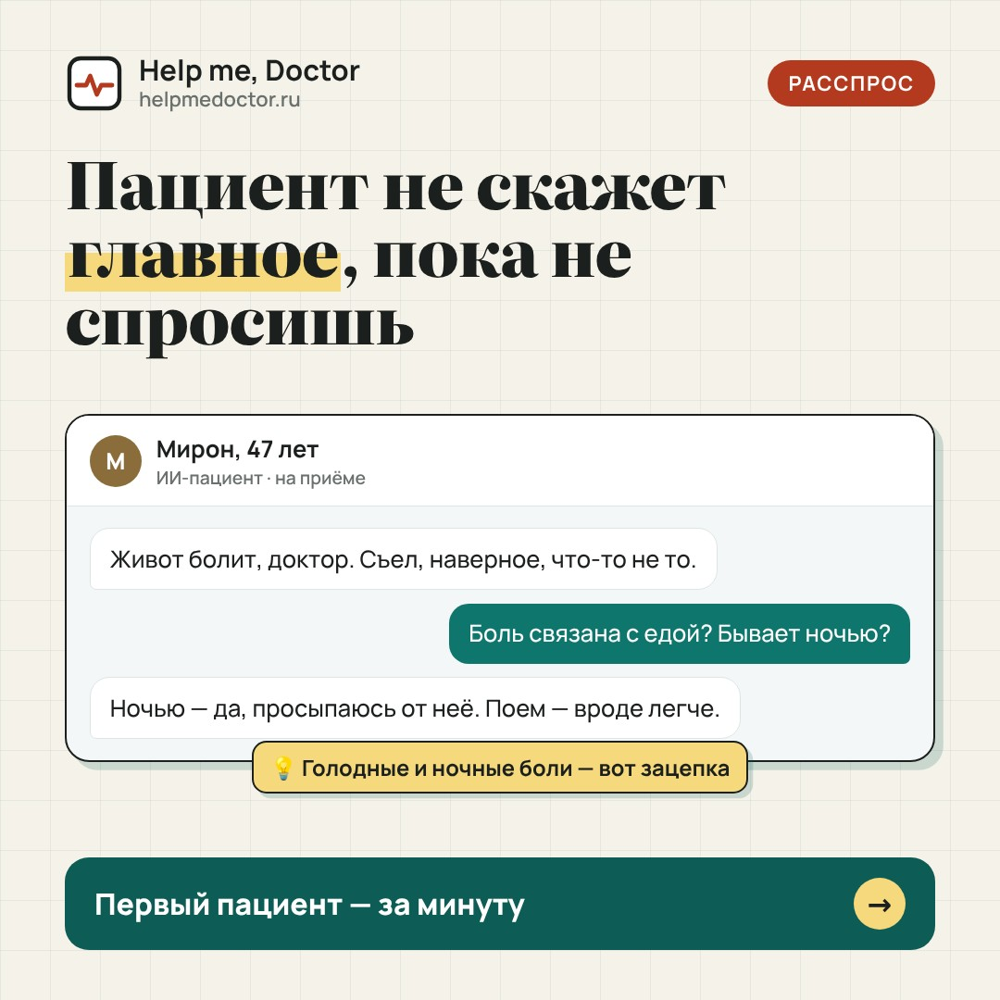 |
| 4:5 | 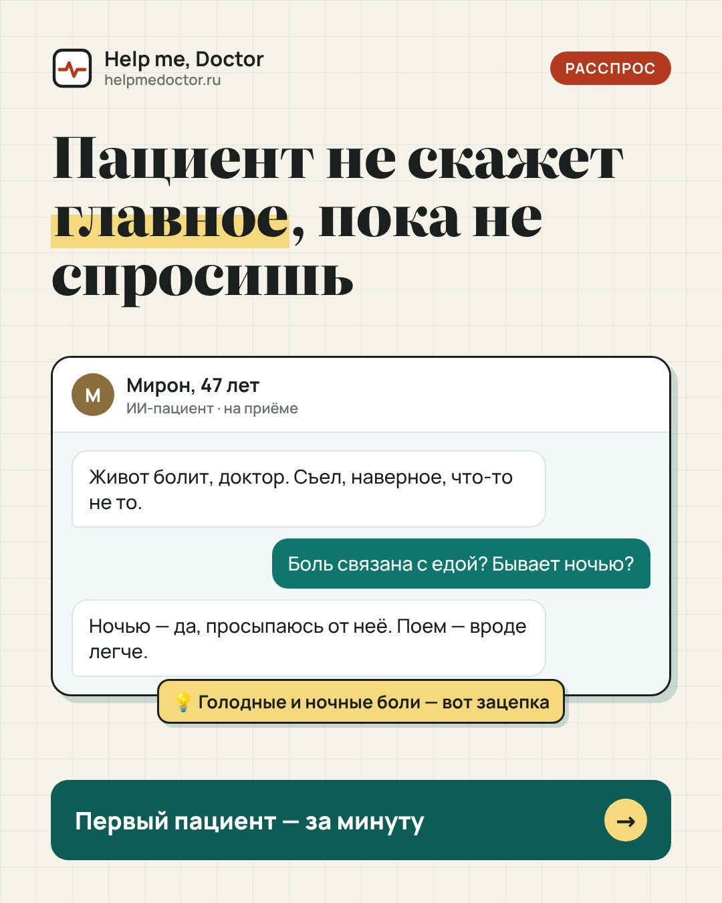 |

| Поле | Текст | Символов |
|---|---|---|
| Заголовок | Пациент не скажет главное сам | 29/40 |
| Короткое описание | Тренажёр расспроса: ИИ-пациенты путаются, недоговаривают и ждут правильного вопроса | 83/90 |
| Длинное описание | Как на настоящем приёме: пациент описывает жалобы своими словами и молчит о важном, пока не спросишь. Учись собирать анамнез, назначать обследования и ставить диагноз. После — оценка эксперта. | 192/220 |
| Текст рядом с кнопкой | Первый пациент — за минуту | 26/30 |
| Кнопка | Начать | |
| Ссылка | https://helpmedoctor.ru/app?from=vk_a02 | |

**Промпт для ChatGPT:**

> Иллюстрация в стиле современного редакционного флэт-дизайна с лёгкой фактурой бумаги, квадрат 1:1. Кабинет врача: мужчина лет 47 сидит на стуле, держится за живот и уклончиво отводит взгляд; над его головой — облачко мысли с перечёркнутой луной и тарелкой (намёк на ночные и голодные боли), которое он не произносит вслух. Напротив — молодой врач в халате с планшетом, внимательно слушает. Палитра: фон тёплая бумага #f5f2e9, бирюзовый #0d5c55, кирпично-красный #b3391f, жёлтый маркер #f5d97c, тёмные контуры. Много воздуха сверху под заголовок. Без текста на картинке.

---

## a03 · Разбор ошибок

| | |
|---|---|
| 1:1 | 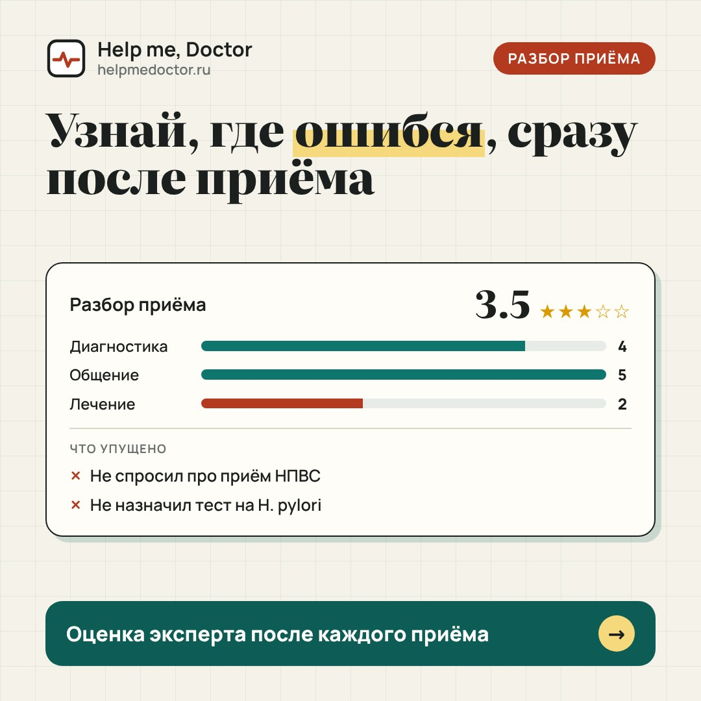 |
| 4:5 | 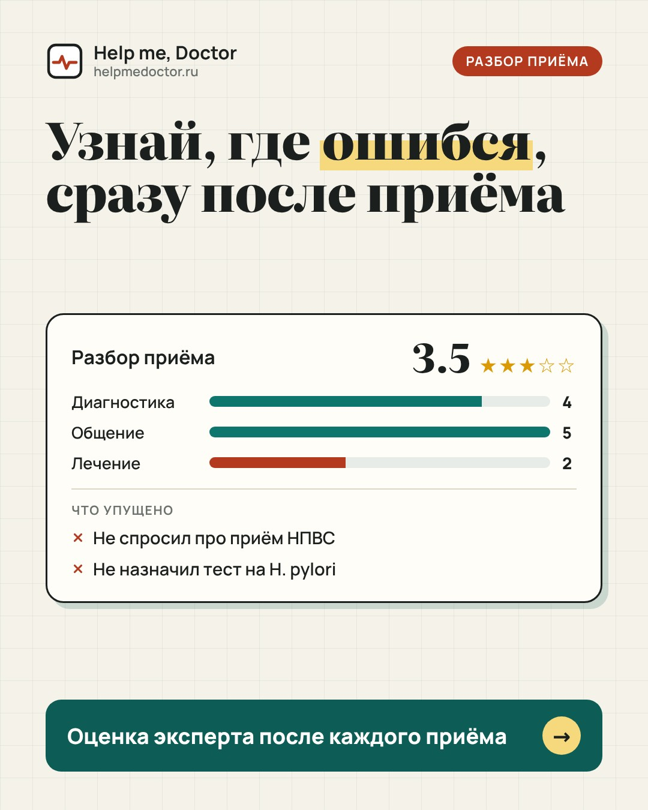 |

| Поле | Текст | Символов |
|---|---|---|
| Заголовок | Разбор ошибок после каждого приёма | 34/40 |
| Короткое описание | Принимаешь ИИ-пациента — эксперт показывает, что упустил в анамнезе, анализах и лечении | 87/90 |
| Длинное описание | Расспрос, обследования, осмотр, диагноз, лечение — а потом оценка по трём шкалам и вывод эксперта. В премиуме — подробный разбор по клиническим рекомендациям и тест по твоим ошибкам: 7 дней за 1 ₽. | 197/220 |
| Текст рядом с кнопкой | Оценка эксперта бесплатно | 25/30 |
| Кнопка | Попробовать | |
| Ссылка | https://helpmedoctor.ru/app?from=vk_a03 | |

**Промпт для ChatGPT:**

> Фотореалистичный крупный план, квадрат 1:1: рука студента-медика держит смартфон над столом; на экране — карточка с оценкой «3.5» и звёздами, три горизонтальные шкалы (две почти полные бирюзовые, одна короткая красная) и два пункта списка с красными крестиками. Рядом на столе — стетоскоп, кружка чая, тетрадь с пометками. Мягкий тёплый свет, малая глубина резкости, фон размыт. Палитра: бумажно-бежевый, бирюзовый #0d5c55, акцент красный #b3391f. Текст на экране неразборчивый, без логотипов. Сверху место под заголовок.

---

## a04 · Голос

| | |
|---|---|
| 1:1 | 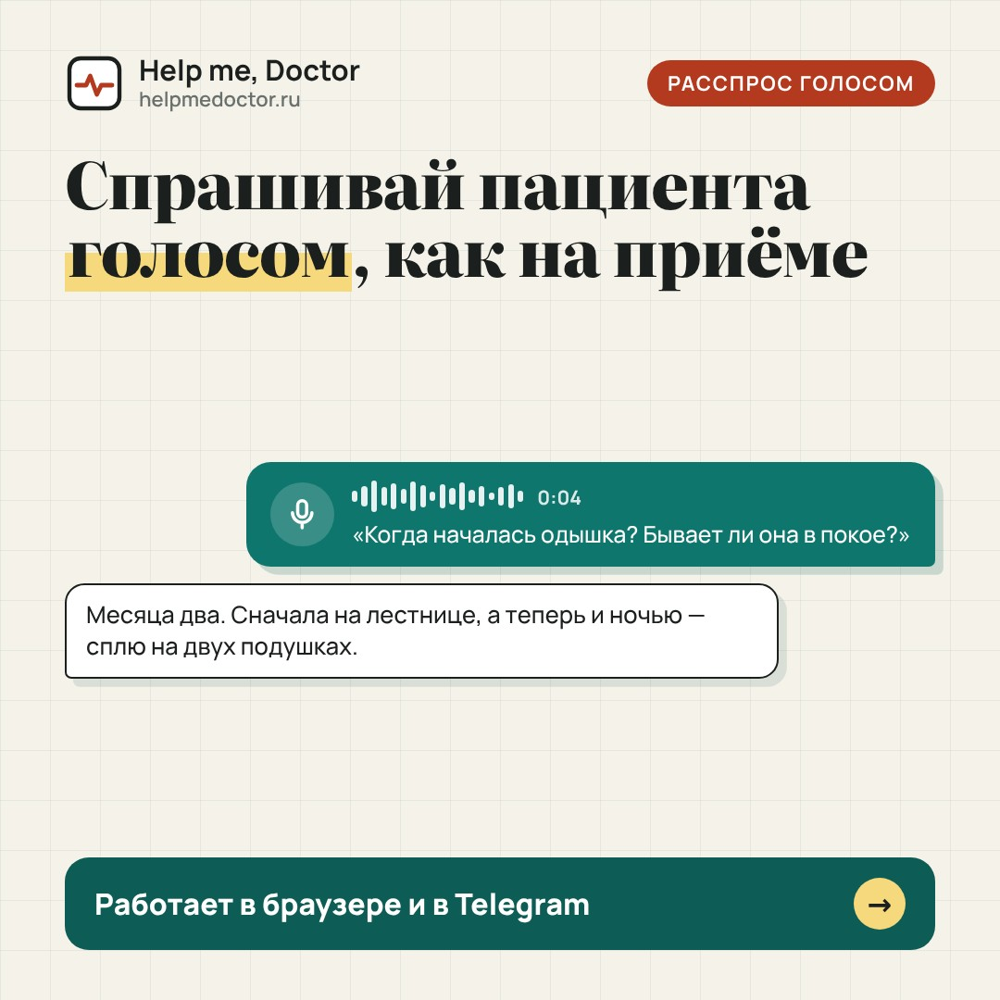 |
| 4:5 | 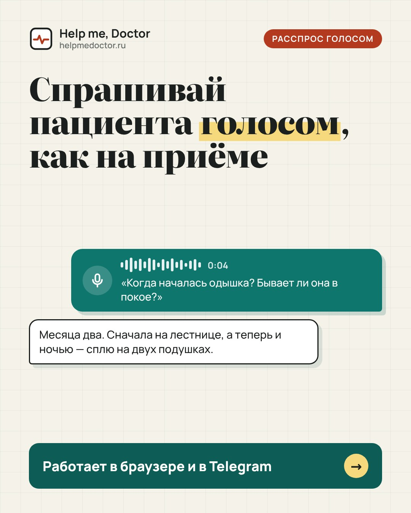 |

| Поле | Текст | Символов |
|---|---|---|
| Заголовок | Собирай анамнез голосом | 23/40 |
| Короткое описание | Говоришь с ИИ-пациентом вслух — он отвечает своими словами. Тренажёр для студентов-медиков | 90/90 |
| Длинное описание | Нажми микрофон и спрашивай, как на настоящем приёме: пациент поймёт и ответит своими словами. Назначай анализы и осмотр, ставь диагноз — и получай оценку эксперта. Работает в браузере и в Telegram. | 197/220 |
| Текст рядом с кнопкой | Без установки — в браузере | 26/30 |
| Кнопка | Попробовать | |
| Ссылка | https://helpmedoctor.ru/app?from=vk_a04 | |

**Промпт для ChatGPT:**

> Фотореалистичная сцена, вертикаль 4:5. Студент-медик в форменном медицинском костюме (бирюзовом) стоит у окна в коридоре больницы и говорит в смартфон, держа его как рацию у рта; на экране видна большая кнопка микрофона и звуковая волна. Лёгкая улыбка, уверенный вид. Вечерний тёплый свет, размытый фон коридора. Палитра: бирюзовый #0d5c55, тёплый бежевый #f5f2e9, немного кирпично-красного. Без логотипов, без текста. Сверху место под заголовок.

---

## a05 · Анализы с нормами

| | |
|---|---|
| 1:1 | 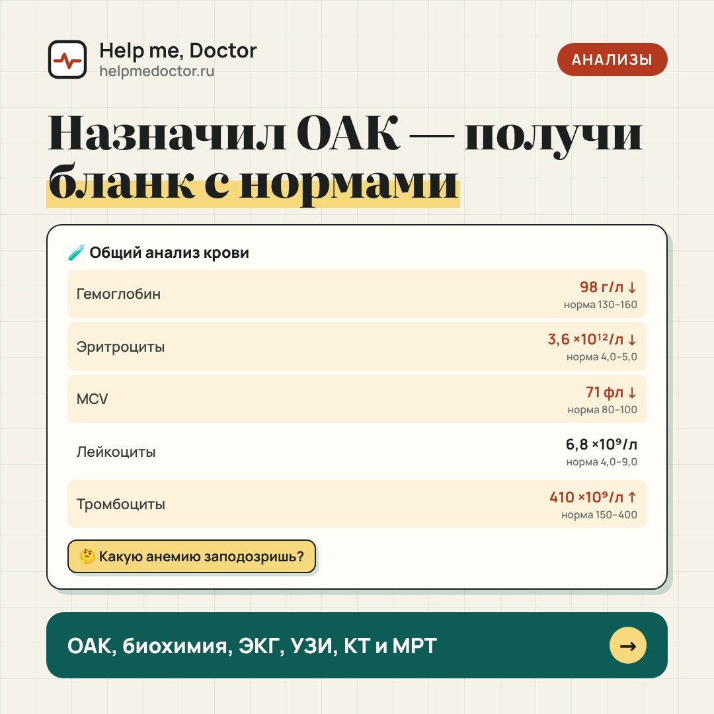 |
| 4:5 | 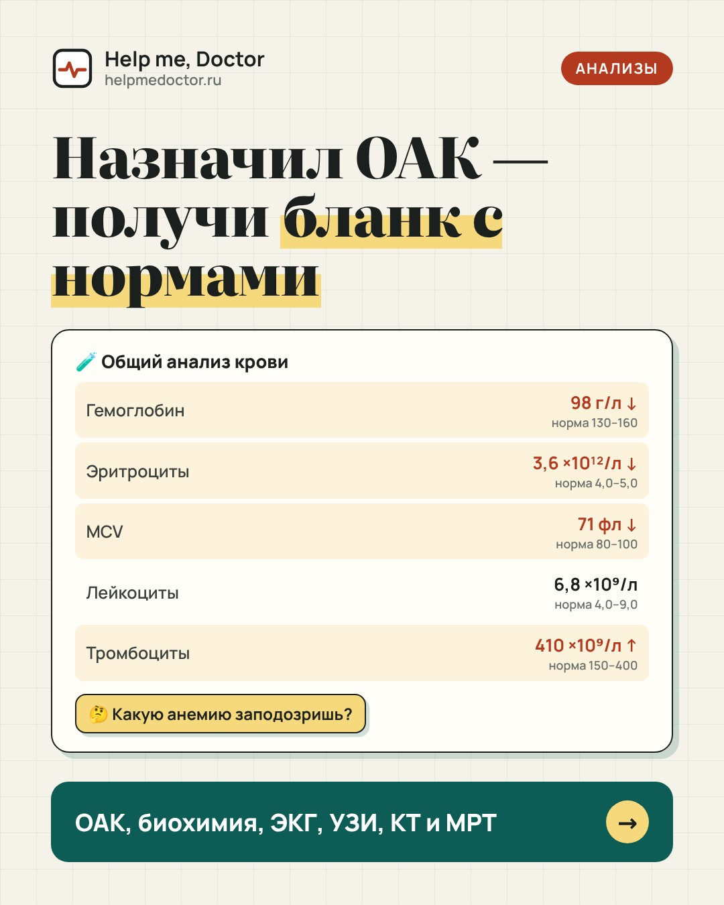 |

| Поле | Текст | Символов |
|---|---|---|
| Заголовок | Анализы приходят, как в жизни | 29/40 |
| Короткое описание | ОАК, биохимия, ЭКГ, УЗИ, КТ — результаты с нормами. Найди отклонения и поставь диагноз | 86/90 |
| Длинное описание | Назначаешь обследования ИИ-пациенту — получаешь результаты с референсами: отклонения видно сразу, а выводы делаешь сам. Тренируй чтение анализов на клинических случаях, а не на сухих таблицах. | 192/220 |
| Текст рядом с кнопкой | 2 пациента в день бесплатно | 27/30 |
| Кнопка | Попробовать | |
| Ссылка | https://helpmedoctor.ru/app?from=vk_a05 | |

**Промпт для ChatGPT:**

> Фотореалистичный натюрморт сверху (flat lay), квадрат 1:1: на светлом столе лежит бланк лабораторного анализа крови (таблица, часть строк обведена красной ручкой, цифры неразборчивы), пробирка с фиолетовой крышкой в штативе, стетоскоп, смартфон с бирюзовым интерфейсом, жёлтый текстовыделитель. Мягкий рассеянный дневной свет, чистая композиция, много свободного места в верхней трети под заголовок. Палитра: тёплый белый, бирюзовый #0d5c55, красный #b3391f, жёлтый #f5d97c. Без логотипов и читаемого текста.

---

## a06 · Дуэль «Кто круче?»

| | |
|---|---|
| 1:1 | 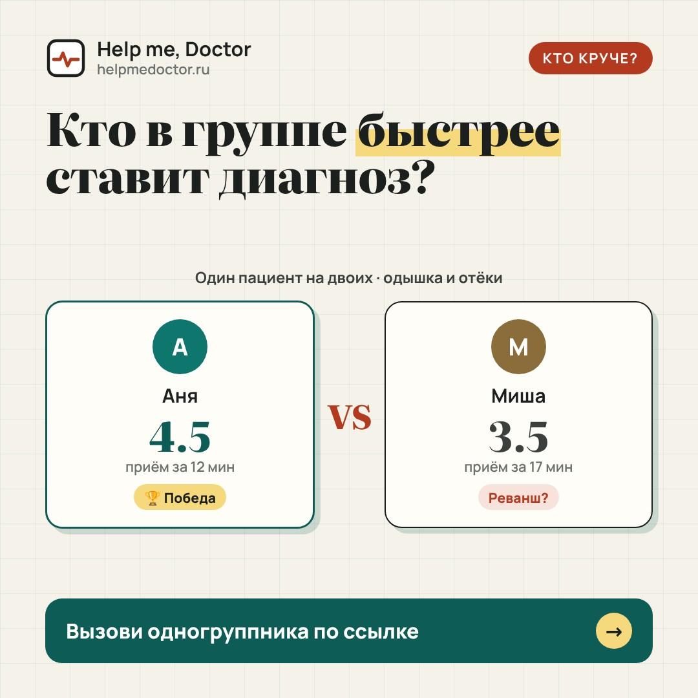 |
| 4:5 | 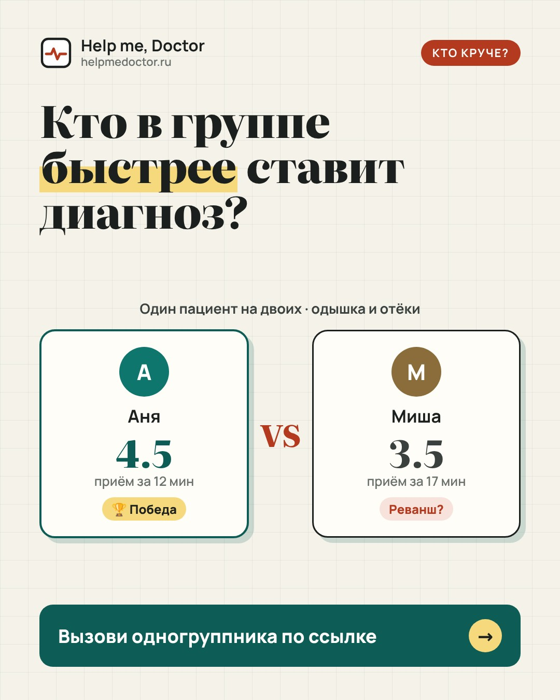 |

| Поле | Текст | Символов |
|---|---|---|
| Заголовок | Дуэль с одногруппником на диагноз | 33/40 |
| Короткое описание | Один пациент на двоих: кто поставит диагноз точнее и быстрее. Режим «Кто круче?» | 80/90 |
| Длинное описание | Брось вызов другу ссылкой — вы оба принимаете одного и того же ИИ-пациента. Точнее диагноз, лучше лечение, быстрее приём — выше счёт. Проиграл — требуй реванша. | 160/220 |
| Текст рядом с кнопкой | Вызови друга по ссылке | 22/30 |
| Кнопка | Начать | |
| Ссылка | https://helpmedoctor.ru/app?from=vk_a06 | |

**Промпт для ChatGPT:**

> Яркая динамичная иллюстрация в стиле спортивного постера, квадрат 1:1. Два студента-медика в белых халатах стоят друг напротив друга, каждый со смартфоном в руке, азартно и по-дружески; между ними крупная буква-символ «VS» в виде кардиограммы. Над ними — силуэт одного пациента, общего для обоих. Фон — тёплая бумага #f5f2e9 с тонкой бирюзовой сеткой, акценты бирюзовый #0d5c55 и кирпично-красный #b3391f, золотая звёздочка победителя. Плоский рисунок с чёткими контурами и лёгкими тенями. Без текста кроме «VS».

---

## a07 · Бесплатно

| | |
|---|---|
| 1:1 | 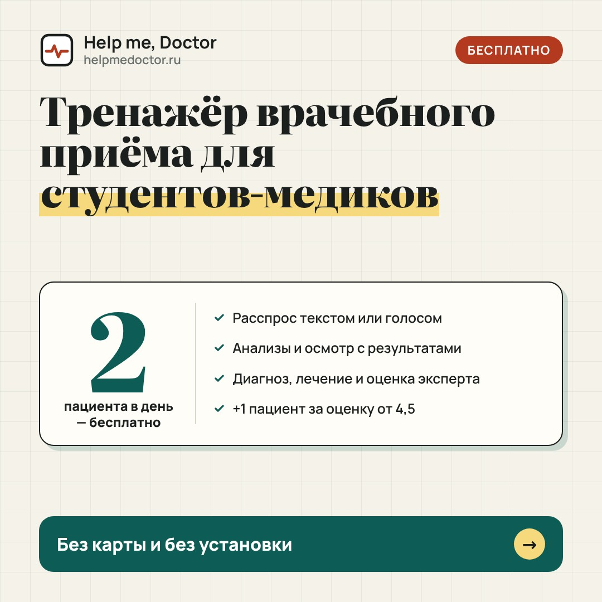 |
| 4:5 | 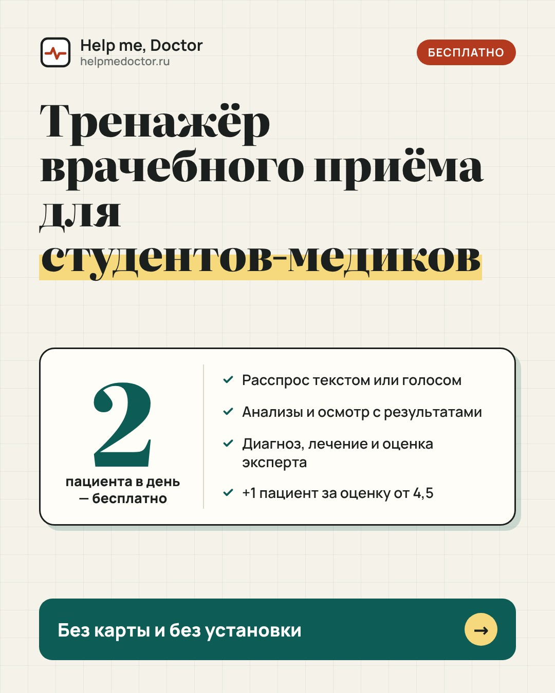 |

| Поле | Текст | Символов |
|---|---|---|
| Заголовок | 2 ИИ-пациента в день бесплатно | 30/40 |
| Короткое описание | Тренажёр врачебного приёма: расспрос, анализы, диагноз и оценка эксперта. Без карты | 83/90 |
| Длинное описание | Каждый день — два новых клинических случая. Принимай пациента, назначай обследования, ставь диагноз и получай оценку с выводом эксперта. За приём на 4,5 и выше — ещё один пациент сверху. | 186/220 |
| Текст рядом с кнопкой | Без карты и без установки | 25/30 |
| Кнопка | Начать | |
| Ссылка | https://helpmedoctor.ru/app?from=vk_a07 | |

**Промпт для ChatGPT:**

> Минималистичная графика, квадрат 1:1. По центру — огромная цифра «2», собранная из двух медицинских карточек пациентов, лежащих веером; рядом стетоскоп, свернувшийся в форме сердца. Фон — тёплая бумага #f5f2e9 с тонкой бирюзовой сеткой как в тетради, акцентные цвета бирюзовый #0d5c55 и жёлтый маркер #f5d97c, немного кирпично-красного #b3391f. Чистый современный флэт с мягкими тенями. Под цифрой надпись крупно по-русски: «пациента в день бесплатно». Больше никакого текста.

---

## a08 · 10 специальностей

| | |
|---|---|
| 1:1 | 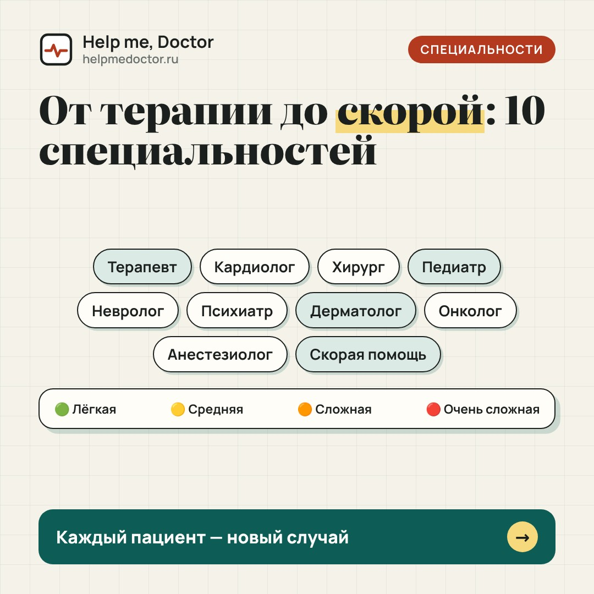 |
| 4:5 | 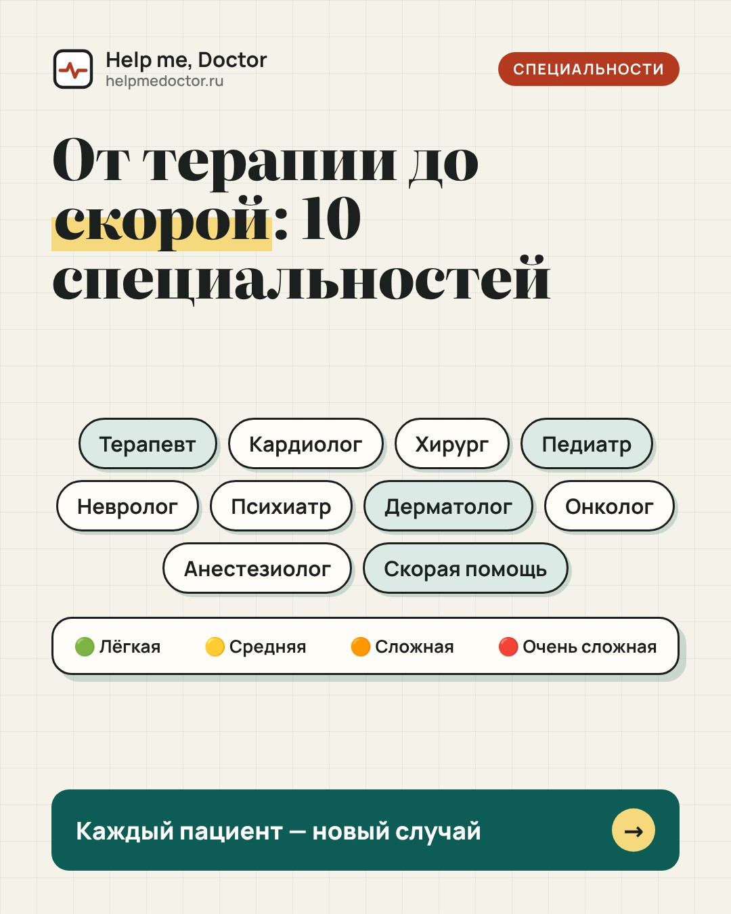 |

| Поле | Текст | Символов |
|---|---|---|
| Заголовок | Клинические случаи по 10 специальностям | 39/40 |
| Короткое описание | Терапия, кардиология, хирургия, педиатрия, неврология и не только. Сложность — на выбор | 87/90 |
| Длинное описание | Выбери специальность и уровень: от типичной картины болезни до редкой патологии с противоречивыми данными. Пациенты каждый раз новые — это не сборник задач, где ответы гуляют по группе. | 185/220 |
| Текст рядом с кнопкой | Сложность от лёгкой до редкой | 29/30 |
| Кнопка | Выбрать | |
| Ссылка | https://helpmedoctor.ru/app?from=vk_a08 | |

**Промпт для ChatGPT:**

> Иллюстрация-коллаж, вертикаль 4:5. Сетка из 10 небольших плоских иконок-сцен в аккуратных скруглённых карточках: сердце с ЭКГ, лёгкие, мозг, детская соска и плюшевый мишка, скальпель, кожа под лупой, капельница, машина скорой помощи, клетка под микроскопом, голова с облачком мыслей. Единый стиль: тонкие тёмные контуры, заливки бирюзовый #0d5c55, кирпично-красный #b3391f, жёлтый #f5d97c на фоне тёплой бумаги #f5f2e9. Верхняя треть свободна под заголовок. Без текста.

---

## a09 · Первый пациент

| | |
|---|---|
| 1:1 | 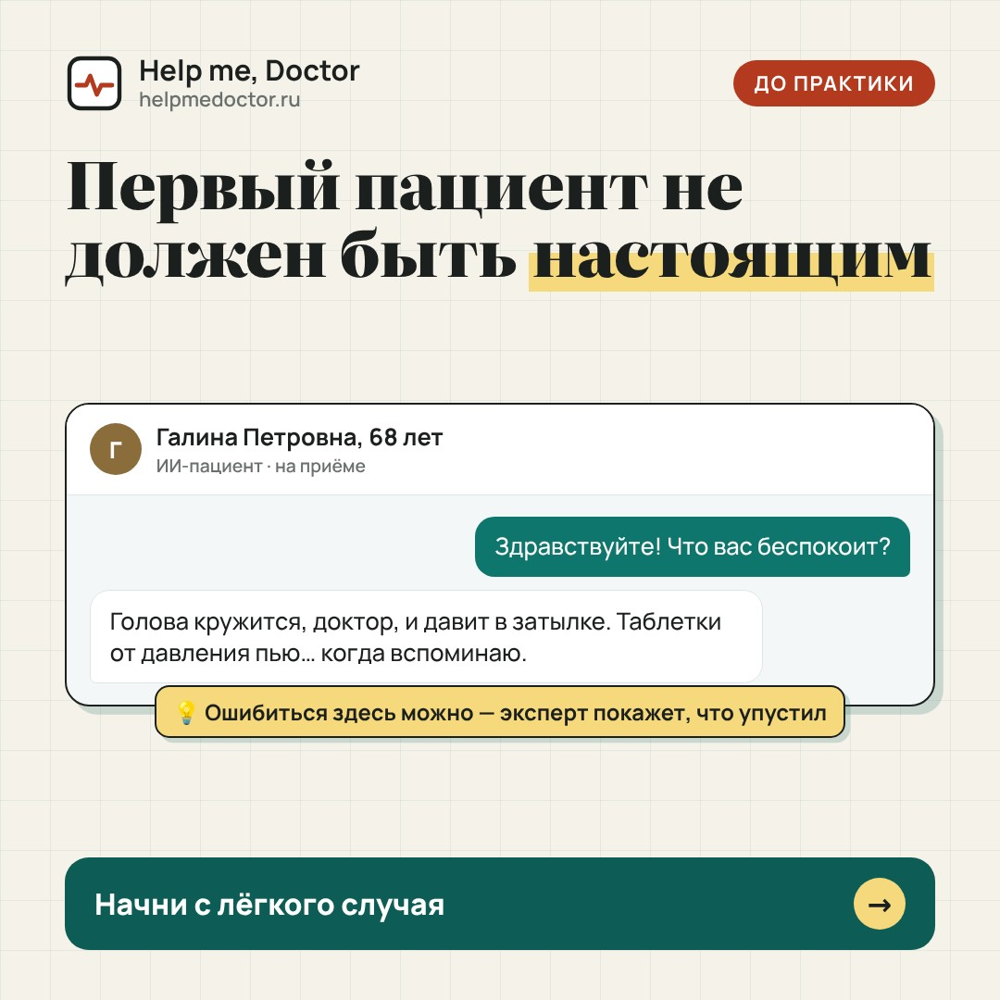 |
| 4:5 | 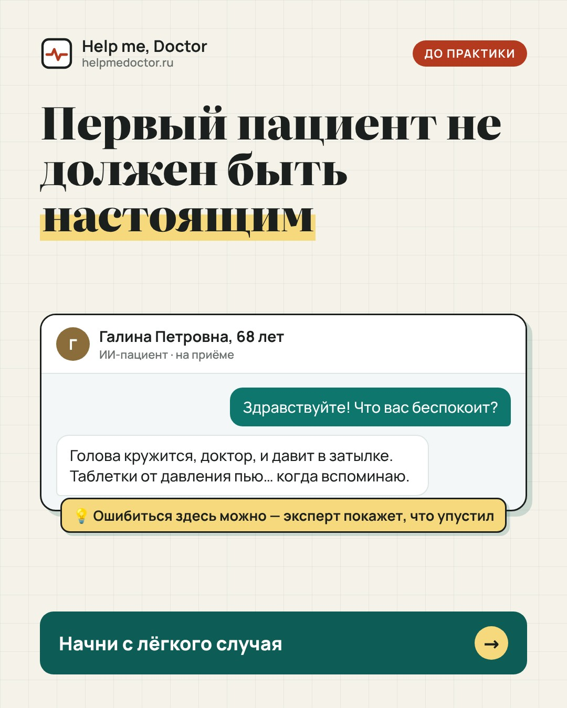 |

| Поле | Текст | Символов |
|---|---|---|
| Заголовок | Ошибайся на тренажёре, а не в палате | 36/40 |
| Короткое описание | Приём ИИ-пациента от жалоб до лечения — потренируйся до практики и ординатуры | 77/90 |
| Длинное описание | На практике страшно спросить лишнее и стыдно ошибиться. Здесь можно: ИИ-пациент не обидится, а эксперт спокойно покажет, что ты упустил. Набей руку на десятках случаев до встречи с живыми пациентами. | 199/220 |
| Текст рядом с кнопкой | Начни с лёгкого случая | 22/30 |
| Кнопка | Попробовать | |
| Ссылка | https://helpmedoctor.ru/app?from=vk_a09 | |

**Промпт для ChatGPT:**

> Тёплая фотореалистичная сцена, вертикаль 4:5. Вечер, общежитие или съёмная квартира: студентка-медик в домашней толстовке сидит на кровати, на коленях ноутбук, рядом на покрывале — белый халат и стетоскоп, кружка чая, стопка учебников. Она сосредоточенно печатает, на экране — чат с пациентом (бирюзовые и белые пузыри, текст неразборчив). Атмосфера: уютно, безопасно, без стресса. Тёплый свет настольной лампы. Палитра с акцентами бирюзового #0d5c55 и тёплого бежевого. Без логотипов и текста, сверху место под заголовок.

---

## a10 · Каждый день

| | |
|---|---|
| 1:1 | 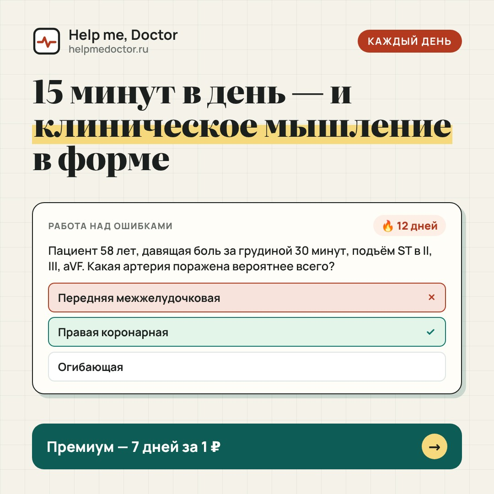 |
| 4:5 | 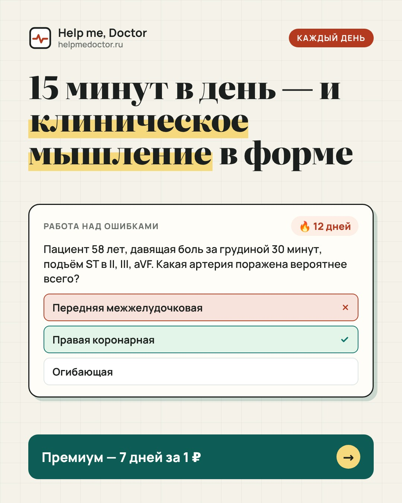 |

| Поле | Текст | Символов |
|---|---|---|
| Заголовок | Клиническое мышление — каждый день | 34/40 |
| Короткое описание | Пациент дня, задания и стрики. После приёма — тест по твоим же ошибкам | 70/90 |
| Длинное описание | Один приём — 10–15 минут, успеешь между парами. Задания дня, опыт и стрик держат в ритме, а тест «работа над ошибками» закрепляет то, на чём споткнулся. Премиум — 7 дней за 1 ₽. | 177/220 |
| Текст рядом с кнопкой | Премиум 7 дней за 1 ₽ | 21/30 |
| Кнопка | Попробовать | |
| Ссылка | https://helpmedoctor.ru/app?from=vk_a10 | |

**Промпт для ChatGPT:**

> Иллюстрация в стиле мобильной игры, но сдержанная и «взрослая», квадрат 1:1. Смартфон крупным планом под небольшим наклоном: на экране карточка теста с вопросом и тремя вариантами ответа (один подсвечен зелёным, один красным; текст неразборчив), над ней — огонёк стрика с цифрой «12». Вокруг телефона летают маленькие элементы: кардиограмма, звёздочки опыта, галочки выполненных заданий. Фон — тёплая бумага #f5f2e9 с бирюзовой сеткой, цвета бирюзовый #0d5c55, кирпично-красный #b3391f, жёлтый #f5d97c. Кроме цифры «12» никакого текста.
